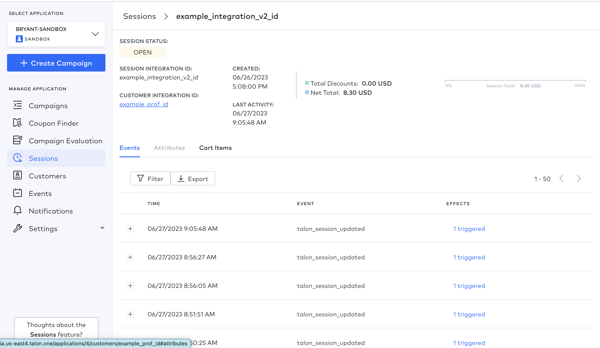

## Talon One Sandbox

### Start Up
To start, just proceed like you would with any NodeJS project

```shell
pnpm i 
pnpm dev
```

### Talon One SDK

This is the documentation from the Talon One GitHub site. Reference to code base is provided at the end of the instructions

#### For Node.js
##### npm

To publish the library as a npm, please follow the procedure in "Publishing npm packages".

Then install it via:

`npm install talon_one --save`

Finally, you need to build the module:

`npm run build`

Local development
To use the library locally without publishing to a remote npm registry, first install the dependencies by changing into the directory containing package.json (and this README). Let's call this JAVASCRIPT_CLIENT_DIR. Then run:

`npm install`

Next, link it globally in npm with the following, also from `JAVASCRIPT_CLIENT_DIR`:

`npm link`

To use the link you just defined in your project, switch to the directory you want to use your talon_one from, and run:

`npm link /path/to/<JAVASCRIPT_CLIENT_DIR>`

Finally, you need to build the module:

`npm run build`

*Ref:* [Talon One Installation Docs](https://github.com/talon-one/talon_one.js/tree/master#installation)
*Ref:* [Talon.One SDK IntegrationAPI Docs ](https://github.com/talon-one/talon_one.js/blob/master/docs/IntegrationApi.md)

Result in Campaign Manager:

